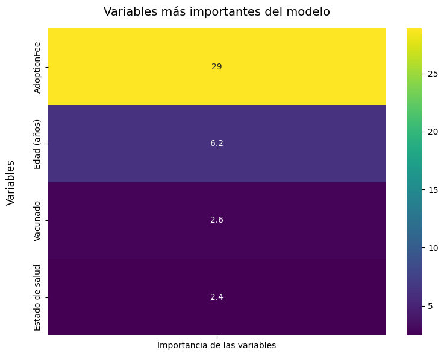
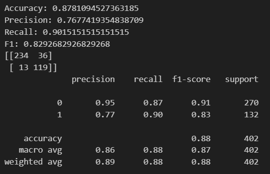
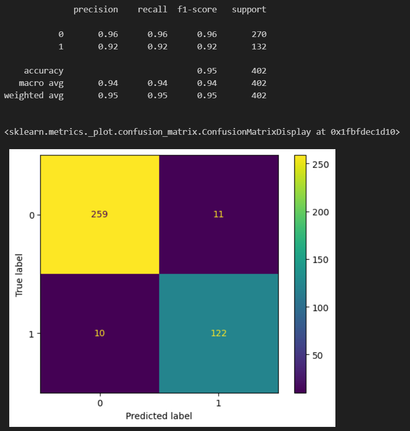

# MODELO PREDICCTIVO DE ADOPCIONES DE DIVERSAS ESPECIES EN BASE A SUS CARACTERÍSTICAS FÍSICAS Y A CARACTERÍSTICAS ECONÓMICAS

## Obtención de datos

Para la realización de este modelo, he empleado el dataset "pet_adoption_data" obtenido a través de Kaggle. En [este enlace](https://www.kaggle.com/datasets/rabieelkharoua/predict-pet-adoption-status-dataset) se puede consultar más información sobre los datos empleados.


## Preparación de los datos

Para la preparación de los datos, se ha llevado a cabo:

### Exploración de los datos

En primer lugar, se ha realizado la carga de los datos en el notebook de exploración (```python df_adopciones = pd.read_csv("../data/Raw/pet_adoption.csv)```). De esta manera, se ha realizado una primera visualización exploratoria de los datos, para verificar:

- Presencia de valores inusuales.
- Presencia de valores nulos.

Una vez se han observado los datos, se procede a la limpieza de los mismos.

### Limpieza de los datos

Una vez realizado el análisis exploratorio de los datos, se ha procedido a realizar la limpieza del dataset:

- Eliminación de variables inservibles: PetID
- Cambio de nombre de la variable target: AdoptionLikelihood -> target
- Tratamiento de las variables: Categóricas -> numéricas (```pyhon pd.get_dummies()```)

Una vez realizados estos cambios, el dataset se guarda limpio ```python(pet_adoption_data_clean_all)``` para su uso en el proceso de modelado.

EXTRA: En este notebook, también se crea un DataFrame con datos hipotéticos para emplearlo tras la realización del modelo para que realice las predicciones de adopción de las mascotas o no.

### Análisis Exploratorio de Datos (EDA)

En este paso, se procede a la observación detallada de las variables. Diferenciando entre variables categóricas y numéricas, se estudia:

- Análisis gráfico de las variables
- Test de análisis de correlación de las variables con la variable "target"
- Test de análisis de la colinealidad de las variables entre ellas mismas

En este caso, el análisis de la colinealidad no se ha realizado de todas las variables contra todas las variables, sino simplemente entre categóricas y ellas mismas, y entre las numéricas y ellas mismas.

Tras este análisis, es pertinente tomar la decisión de ver qué variables permanecen en el modelo y cuáles no. En este caso, todas las variables permanecen dado que se estima que todas ellas pueden aportar datos relevantes para la predicción.

### Modelo predictivo

En primer lugar, para proceder con el entrenamiento del modelo de Regresión Logística, se importan los datos limpios creados en el notebook de limpieza. 

```python
df_adop_all = pd.read_csv("../data/Clean/pet_adoption_data_clean_all.csv")
```

Proceso del modelo:

1. Separación de las variables train y test: Esto se realiza para dividir el dataset entre datos de entrenamiento y datos de test, para verificar el funcionamiento del modelo, y si es preciso realizar ajustes.

Es importante, determinar que los datos de entrenamiento y los de test, a su vez se separan en dos: 

- Por un lado, las variables que ayudarán a la predicción de la variable objetivo (X_train y X_test).
- Por otro lado, la propia variable objetivo (y_train e y_test).

2. Tratamiento y escalado de las variables numéricas

Es muy importante conocer las variables del dataset elegido, dado que el análisis y posteriores tratamientos a las variables dependen mucho del tipo de variable de que se trata. En este caso, el dataset se encuentra dividido entre variables categóricas y numéricas. Pero algunas de las variables categóricas son numéricas binarias. Pero estas últimas no reciben el tratamiento que reciben las numéricas.

Analizando gráficamente las variables numéricas, se observa que tiene una distribución bastante uniforme y simétrica, así como ausencia de valores extremos. Por lo tanto, en este paso, únicamente se procede al escalado de las variables numéricas.

Con el escalado:

- Se favorece que las variables presenten rangos comparables.
- Es preciso realizarlas para el funcionamiento de modelos sensibles, y que el entrenamiento sea más estable y fiable.
- Las variables escaladas, no destacarán unas por encima de otras, evitando que la predicción se respalde en unas variables más que en otras.

Proceso de escalado y aplicación a las variables numéricas del dataset:

```python
from sklearn.preprocessing import StandardScaler

scaler = StandardScaler()
scaler.fit(X_train[numericas])
```

3. Transformación de Train y Test

Previamente a la definición del modelo, es preciso aplicarle los cambios tanto a train como a test:

```python
X_train[numericas] = scaler.transform(X_train[numericas])
X_test[numericas] = scaler.transform(X_test[numericas])
```

4. Realización del modelo

Una vez realizados los pasos anteriores, se puede proceder al entrenamiento del modelo:

```python
log_reg_all = LogisticRegression (max_iter = 5000, class_weight = "balanced")
log_reg_all.fit(X_train, y_train)
```

5. Comprobación de los pesos de las variables: Este es un paso opcional, sirve para conocer cómo pundiona el modelo y cómo afectan las variables al mismo. Un coeficiente positivo, indica aumento de la probabilidad de adopción, frente a los negativos, que indican el descenso de dicha probabilidad.

6. Análisis de la importacia de las variables

Este paso, el cual considero importante, determina qué variables son más importantes para el modelo. Así, se puede saber de una manera más o menos certera, qué variables condicionan más o menos la predicción. En este caso:

```python
intercept = log_reg_all.intercept_
coefs = log_reg_all.coef_.ravel()

features = pd.DataFrame(coefs, X_train.columns, columns=['coefficient']).copy()
features['coefficient'] = np.abs(features['coefficient'])

features.sort_values('coefficient', ascending=False).head()
```


7. Aplicación de las métricas 

La aplicación de las métricas al modelo entrenado, significa observar:

- El porcentaje de acierto del modelo (Accuracy)
- La precisión en la predicción (Precision)
- Datos reales (sean adopciones o no) capaces de detectar (Recall)
- Equilibrio del modelo (F1)

```python
from sklearn.metrics import precision_score, recall_score, f1_score

print("Accuracy:", accuracy_score(y_test, y_pred)) # % total de aciertos
print("Precision:", precision_score(y_test, y_pred)) # Cuántas adopciones realmente lo son
print("Recall:", recall_score(y_test, y_pred)) # Adopciones (1) reales capaces de detectar
print("F1:", f1_score(y_test, y_pred)) # Equilibrio entre precision y recall

print(confusion_matrix(y_test, y_pred))
print(classification_report(y_test, y_pred))
```


### Comparación con otros modelos predictivos de clasificación

A pesar de que este modelo ha obtenido métricas muy adecuadas, va a ser comparado con otros modelos predictivos. Esto determinará qué modelo es mejor para la predicción de este problema.

Los modelos contra los que se realizará la comparación serán:

- DecisionTreeClassifier (Árboles de decisión)
- RandomForestClassifier
- XGBClassifier (XGBoost)
- LGBMClassifier

El proceso es el siguiente:

1. Importanción de librerías y definición de los modelos

```python
features = X_train.columns.to_list()

scaler = StandardScaler()
X_train = X_train[features]
y_train = y_train.astype("int32")
X_test = X_test[features]
y_test = y_test.astype("int32")
X_train_scaled = pd.DataFrame(scaler.fit_transform(X_train), columns= features)
X_test_scaled = pd.DataFrame(scaler.transform(X_test), columns = features)

from sklearn.linear_model import LogisticRegression
from sklearn.tree import DecisionTreeClassifier
from sklearn.ensemble import RandomForestClassifier
from xgboost import XGBClassifier
from lightgbm import LGBMClassifier


tree_clf = DecisionTreeClassifier(max_depth=None, class_weight="balanced",random_state= 42)
rf_clf = RandomForestClassifier(n_estimators=300, max_depth=None, class_weight="balanced",random_state= 42)
xgb_clf = XGBClassifier(n_estimators=200, learning_rate=0.1, max_depth=6, subsample=0.8, colsample_bytree= 0.8,
                        objective = "binary:logistic", eval_metric = "logloss", random_state = 42)
lgb_clf = LGBMClassifier(objective = "binary", random_state= 42, verbose = -100)


model_set = [log_reg_all, tree_clf, rf_clf, xgb_clf, lgb_clf]

model_names = ["LogisticRegression","DecisionTree","Random Forest","XGBoost","LightGBM"]
```
2. Entrenamiento de los modelos nuevos

```python
# Random Forest
rf_clf.fit(X_train, y_train)

# XGBoost
xgb_clf.fit(X_train, y_train)

# Árbol de decisión
tree_clf.fit(X_train, y_train)

# LGBM
lgb_clf.fit(X_train, y_train)
```

3. Cross - Validation

Con los modelos entrenados, se procede a realizar la comparación entre ellos para determinar cuál de ellos es el mejor para abordar la predicción que se quiere llevar a cabo:

```python
metricas_cv = {}
valores = []
for nombre,modelo in zip(model_names, model_set): 
    print(modelo)
    if nombre != "LogisticRegression":
        metricas_cv[nombre] = cross_val_score(modelo, X_train, y_train, cv = 3, scoring = "accuracy")
    else:
        metricas_cv[nombre] = cross_val_score(modelo, X_train_scaled, y_train, cv = 3, scoring = "accuracy")
    valores.append(np.mean(metricas_cv[nombre]))
ganador = list(metricas_cv.keys())[np.argmax(valores)]

for model_name, valores in metricas_cv.items():
    print(f"Model <{model_name}>, Accuracy_CV: {np.mean(valores)}")
print(f"El ganador es {ganador}")
```
En este caso, el modelo ganador es XGBoost, por lo que las predicciones se llevarán a cabo con este modelo.

4. Optimización de los hiperparámetros del modelo ganador

Este paso, sirve para mejorar el rendimiento del modelo. Ajustando los parámetros internos, se favorece un mejor funcionamiento del modelo aportándole los parámetros que no es capaz de aprender por sí mismo durante su entrenamiento. El proceso es el siguiente:

```python
params_grid = {
    "n_estimators": [100,200,400],
    "max_depth": [2,4,10],
    "min_samples_leaf": [10,20,40],
    "max_features": ["sqrt","log2",None],
    "max_samples": [0.3,0.6,1]
}

rf_grid = GridSearchCV(rf_clf,
                       param_grid= params_grid,
                       cv = 3,
                       scoring = "accuracy",
                       n_jobs = -1)

rf_grid.fit(X_train, y_train)

rf_grid.best_score_

rf_grid.best_params_
```

Una vez realizado este proceso, se observan las métricas del modelo de nuevo y la matriz de confusión:

```python
y_pred = rf_grid.best_estimator_.predict(X_test)
print(classification_report(y_test, y_pred))
ConfusionMatrixDisplay.from_predictions(y_test, y_pred)
```



5. Guardado de los modelos

Para salvar los modelos ya entrenados, se eplica la librería "joblib". En este caso, se muestra el guardado del modelo que va a ser empleado. Para ello:

- ```python import joblib```
- ```python joblib.dump(xgb_clf, "../scr_models/XGBoost_modelo_main.pkl")````

### Prueba del modelo

Para proceder con la prueba del modelo, se importa el dataset de predicción creado en el notebook de limpieza de datos:

```python
df_predicciones_scaled.to_csv("../data/Clean/predicciones_escaladas.csv", index = False)
```

A continuación se procede a realizar la predicción:

```python
pred = xgb_clf.predict(df_predicciones_scaled)
proba = xgb_clf.predict_proba(df_predicciones_scaled)[:, 1]

pred, proba
```

## Interpretación de los resultados

Finalmente, para terminar con el proyecto, se deben interpretar los datos obtenidos y relacionarlos con el estudio realizado. En este caso la predicción obtenida, es que únicamente el último animal de la predicción sería adoptado.

Las probabilidades de adopción de cada animal serían:

| Probabilidad de adopción | Animal | Peso | Vacunación | Sano | Días en el refugio | Cuota | Dueño previo | Edad (años) | Color del pelaje | Tamaño |
| ------------------------ | ------ | ---- | ---------- | ---- | ------------------ | ----- | ------------ | ---- | ---------------- | ------ |
| 22,96 % | Conejo | 10 kg | Sí | Sí | 12 | 100 | No | 5 | Marrón | Grande |
| 6,24 % | Gato Siamés | 7 kg | No | No | 40 | 250 | Sí | 3 | Naranja | Mediano |
| 1,88 % | Periquito | 1 kg | Sí | No | 26 | 70 | Sí | 6 | Gris | Pequeño |
| 4,84 % | Gato Persa | 20 kg | Sí | No | 32 | 300 | Sí | 3 | Marrón | Grande |
| 10,14 % | Perro Labrador | 35 kg | Sí | No | 400 | 120 | Sí | 13 | Negro | Grande |
| 21,30 % | Conejo | 15 kg | Sí | Sí | 28 | 57 | No | 10 | Blanco | Grande |
| 14,87% | Gato Persa | 2 kg | Sí | Sí | 3 | 250 | No | 6 (meses) | Marrón | Grande |
| 9,97 % | Perro Poodle | 3 kg | Sí | No | 20 | 232 | No | 7 (meses) | Marrón | Mediano |
| 14,56 % | Perro Golden Retriever | 45 kg | Sí | Sí | 50 | 452 | No | 6 | Naranja | Pequeño |
| 91,61 % | Perro Labrador | 27 kg | Sí | Sí | 45 | 179 | Sí | 2.5 | Marrón | Mediano |